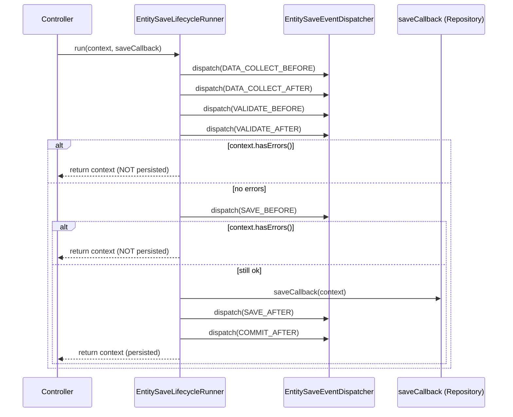

# Entity Save Lifecycle

**Status:** Foundation delivered (Phase 1.20); locked in by tests (1.21, 1.23);
controller integration in progress (1.23 recipe -> 1.24 full wiring).

## Overview

The entity save lifecycle is how Zoosper saves admin entities (pages, admin users,
and future entities) in a **modular, extensible** way. Instead of a controller
writing submitted values straight to SQL, the save runs through a small set of
labelled lifecycle stages. Modules can register **listeners** on any stage to
normalise, validate, react to, or **block** a save - all **without editing core
controllers**.

Design goals:

- **Clean controllers** - controllers orchestrate request flow, not per-field SQL.
- **Extend without touching core** - third-party modules hook the lifecycle.
- **No blind POST -> SQL** - only fields a module declares are ever persisted.

## Components

| Component | Responsibility |
|---|---|
| `EntitySaveEventDispatcherInterface` / `EntitySaveEventDispatcher` | Register listeners (`listen`) and fire stage events (`dispatch`). |
| `EntitySaveEventListenerInterface` | Contract for object listeners: `handle(EntitySaveContext): void`. |
| `EntitySaveLifecycle` | The 7 canonical stage-name constants (below). |
| `EntitySaveContext` | Per-save state: entity type/id, the `EntityDataObject`, the `FieldDefinitionRegistry`, and accumulated errors. |
| `EntityDataObject` | Mutable data bag of submitted/derived values (`setData`/`getData`/`addData`/`only`/extension data). |
| `FieldDefinition` + `FieldStorageType` | Declares each field as `CoreColumn`, `ExtensionTable` or `Virtual`. |
| `FieldDefinitionRegistry` | Produces the safe write map (`coreColumnWriteMap`, `coreColumnData`, `extensionData`). |
| `EntitySaveLifecycleRunner` | Orchestrates the stages around a caller-supplied `$saveCallback`. |
| `EntityExtensionDataPersister` | Persists only `ExtensionTable` fields to the generic extension store. |

## The 7 lifecycle stages (in order)

| # | Constant | When it fires | Typical use |
|---|---|---|---|
| 1 | `DATA_COLLECT_BEFORE` | Before assembling the data bag | Seed defaults |
| 2 | `DATA_COLLECT_AFTER`  | After the data bag is assembled | Normalise/trim values |
| 3 | `VALIDATE_BEFORE`     | Before validation | Cross-field checks |
| 4 | `VALIDATE_AFTER`      | After validation | Add errors; last chance to block cheaply |
| 5 | `SAVE_BEFORE`         | Immediately before persistence | Final guard; reserve resources |
| 6 | `SAVE_AFTER`          | Immediately after persistence | Side effects needing the saved row (extension data, indexing) |
| 7 | `COMMIT_AFTER`        | After the save is committed | Cache clear, notifications, audit |

## Sequence



## Error handling & abort semantics

The runner checks `EntitySaveContext::hasErrors()` **after the validate stages**
and again **after `SAVE_BEFORE`**. If any listener has called
`$context->addError($field, $message)`, the runner **returns without calling the
save callback** - nothing is persisted. This is how a module can veto a save
without touching the controller.

## Field storage types & the safe write map

`FieldDefinitionRegistry` classifies each declared field:

- **`CoreColumn`** - written directly to the entity table. `coreColumnWriteMap()`
  returns `field => column`; `coreColumnData($data)` returns `column => value`.
- **`ExtensionTable`** - stored via `EntityExtensionDataPersister` into the generic
  extension-value store (keyed by module).
- **`Virtual`** - never persisted (e.g. `_csrf_token`, transient UI fields).

Undeclared submitted values are ignored - no blind writes.

## Example: a save listener

```php
<?php

declare(strict_types=1);

namespace Acme\Blog\Save;

use Zoosper\Core\Entity\Save\EntitySaveContext;
use Zoosper\Core\Entity\Save\EntitySaveEventListenerInterface;

/**
 * Rejects pages whose title is shorter than 3 characters.
 */
final class TitleLengthListener implements EntitySaveEventListenerInterface
{
    public function handle(EntitySaveContext $context): void
    {
        $title = trim((string) $context->data()->getData('title', ''));
        if ($title !== '' && mb_strlen($title) < 3) {
            $context->addError('title', 'Title must be at least 3 characters.');
        }
    }
}
```

## Example: registering the listener (module config/services.php)

```php
<?php

declare(strict_types=1);

use Acme\Blog\Save\TitleLengthListener;
use Zoosper\Core\Container\ServiceContainer;
use Zoosper\Core\Entity\Save\EntitySaveEventDispatcher;
use Zoosper\Core\Entity\Save\EntitySaveEventDispatcherInterface;
use Zoosper\Core\Entity\Save\EntitySaveLifecycle;
use Zoosper\Core\Entity\Save\EntitySaveLifecycleRunner;

return [
    // Shared dispatcher with module listeners attached.
    EntitySaveEventDispatcherInterface::class => static function (): EntitySaveEventDispatcherInterface {
        $dispatcher = new EntitySaveEventDispatcher();
        $dispatcher->listen(EntitySaveLifecycle::VALIDATE_AFTER, new TitleLengthListener());

        return $dispatcher;
    },

    // Runner built on the shared dispatcher.
    EntitySaveLifecycleRunner::class => static fn (ServiceContainer $c): EntitySaveLifecycleRunner
        => new EntitySaveLifecycleRunner($c->get(EntitySaveEventDispatcherInterface::class)),
];
```

## PCI note

Listeners and context data are for CMS entity fields only. Never place OTPs, TOTP
secrets, recovery-code plaintext, reset tokens, session/CSRF tokens, SMTP
passwords, or payment data into the data bag, and never log them from a listener.
