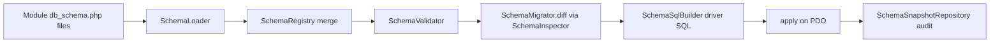

# Schema Engine (unified target state)

## One declarative schema engine

Zoosper uses a **single** declarative schema engine. Each module owns its tables
in `config/db_schema.php` using this format:

```php
<?php

declare(strict_types=1);

return [
    'tables' => [
        'my_table' => [
            'columns' => [
                'id'         => ['type' => 'integer', 'primary' => true, 'auto_increment' => true],
                'title'      => ['type' => 'string', 'length' => 190, 'nullable' => false],
                'is_active'  => ['type' => 'boolean', 'nullable' => false, 'default' => false],
                'payload'    => ['type' => 'json', 'nullable' => true],
                'created_at' => ['type' => 'datetime', 'nullable' => false, 'default' => 'CURRENT_TIMESTAMP'],
            ],
            'indexes' => [
                'idx_my_table_title' => ['columns' => ['title']],
                'uniq_my_table_slug' => ['columns' => ['title'], 'unique' => true],
            ],
        ],
    ],
];
```

## Column & index reference

**Column** keys:

- `type`: `integer` | `int` | `bigint` | `string` (+ `length`) | `text` |
  `datetime` | `boolean` | `json`
- `nullable`: bool (default false)
- `primary`: bool
- `auto_increment`: bool
- `default`: scalar or `'CURRENT_TIMESTAMP'`

**Index** keys: `columns` (list), `unique` (bool).

## How it runs

1. **`SchemaLoader`** gathers every enabled module's `tables` into a
   **`SchemaRegistry`**. Same-named tables from different modules are **merged**,
   so one module can **add columns to another module's table**.
2. **`SchemaValidator`** checks types, primary/nullable rules, and that indexes
   reference real columns.
3. **`SchemaMigrator::diff()`** asks **`SchemaInspector`** what already exists and
   computes only the **missing** tables/columns/indexes.
4. **`SchemaSqlBuilder`** renders driver-correct SQL (MySQL or SQLite).
5. **`apply()`** executes the statements and **`SchemaSnapshotRepository`** records
   an audit snapshot.

## Commands

```bash
php bin/zoosper-schema validate    # check every module's schema is valid
php bin/zoosper-schema diff        # show the SQL that WOULD run
php bin/zoosper-schema apply       # apply + record a snapshot
php bin/zoosper-schema snapshots   # list recent schema snapshots
php bin/zoosper migrate            # run file migrations, then the same engine
```

## Adding a column to another module's table

Because same-named tables merge, a module can extend another module's table by
declaring the same table name with just the new column:

```php
return [
    'tables' => [
        'pages' => [
            'columns' => [
                'meta_title' => ['type' => 'string', 'length' => 255, 'nullable' => true],
            ],
        ],
    ],
];
```

The engine adds `meta_title` to the existing `pages` table if it is missing.

## Additive & safe

The engine only **creates** missing tables, **adds** missing columns, and **adds**
missing indexes. It **never drops or alters** existing columns - destructive
changes require an explicit, audited migration file. This makes running the engine
idempotent and safe to repeat.

## Snapshots (audit trail)

Every `apply` records a row in `schema_snapshots`: a `schema_hash`, the exact
`statements_json`, and `created_at`. This is your history of how the database
structure evolved.

## PCI note

Never put secrets in schema defaults. Secret-bearing columns store **ciphertext or
hashes only** - e.g. two-factor `secret_ciphertext`, recovery `code_hash`,
challenge `challenge_token_hash`. The schema layer describes structure, not values.

## Pipeline


